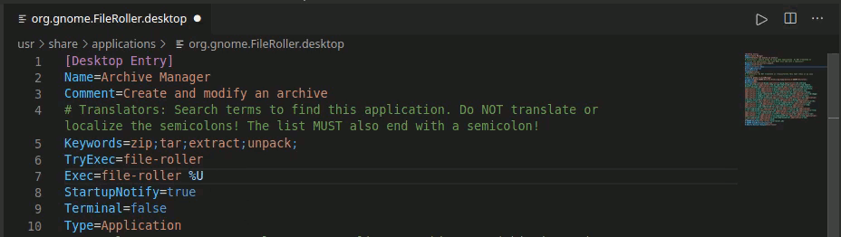

# Desktop Entry files support

Adds support for .desktop and .directory files to the VS Code.

## Installation

Install from Github:   
or  
Launch VS Code Quick Open (Ctrl+P) and run command `ext install almaceleste.desktop-entry-files`

## Features

* Syntax highlighting
* Errors highlighting

### Screenshots

Syntax highlighting example

Errors highlighting example

### TODO

* Folding
* IntelliSense

## Release Notes

### 0.1.0

Added: Syntax highlighting  
Added: Errors highlighting
